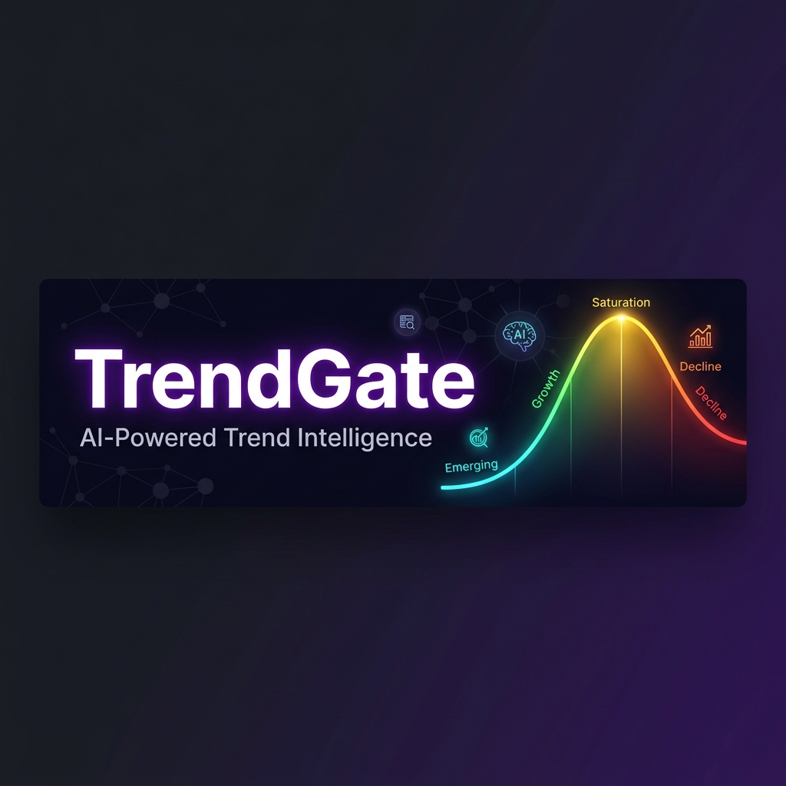

<div align="center">


# 🚀 TrendGate
### *The AI That Tells You When Your Trend Is About to Die — Before It Does*
<br/>

[](https://python.org)
[](https://fastapi.tiangolo.com)
[](https://react.dev)
[](https://vitejs.dev)
[](https://deepmind.google/technologies/gemini/)
[](https://groq.com)

<br/>

> **"Every trend has a lifecycle. Most brands discover the decline too late.**
> **TrendGate discovers it first."**

</div>

---

## 🔥 What Is TrendGate?

TrendGate is a **full-stack AI trend intelligence platform** for marketers, content creators, and brand managers who are tired of discovering their big campaign launched *right after* the trend peaked.

It **models the hidden lifecycle** of any trend using a 5-state Gaussian Hidden Markov Model, then fuses that with **live Google Search**, **LLaMA-3 reasoning**, and **Gemini Vision** to produce:

- 📉 **Early decline detection** — days before the data makes it obvious
- 🔍 **AI root cause analysis** — *why* is it declining? Creator exodus? Controversy? Algorithm change?
- 🎯 **Campaign viability scores** — should you launch into this trend right now?
- 👁️ **Post vision analysis** — upload your draft, get AI feedback on viral potential
- #️⃣ **Hashtag intelligence** — which tags are rising vs. dying?

---

## 😱 The Problem

| ❌ Status Quo | ✅ TrendGate |
|---|---|
| Decline noticed only after engagement crashes | Detects decline days before it's obvious |
| Nobody knows *why* a trend is dying | Root cause explained in plain English by LLaMA-3 |
| Campaign timing is gut-feel | Viability score backed by Gemini + live Google data |
| Hashtag selection is guesswork | Real-time ranked comparison |
| Post performance is unpredictable | Gemini Vision scores your post before you publish |

---

## 🏗️ Architecture

```
╔═══════════════════════╦════════════════════════════════════════╗
║   FRONTEND            ║   React 19 + Vite + Recharts           ║
║   localhost:5173      ║   Campaign Analyzer · HMM Dashboard    ║
╠═══════════════════════╬════════════════════════════════════════╣
║   BACKEND             ║   FastAPI + uvicorn · 10 REST endpoints║
║   localhost:8000      ║   Pydantic validation · CORS           ║
╠═══════════════════════╬════════════════════════════════════════╣
║   INTELLIGENCE CORE   ║   5-State Gaussian HMM + Viterbi       ║
║   trendguard/         ║   3-Step Explainability Pipeline       ║
╠═══════════════════════╬════════════════════════════════════════╣
║   AI SERVICES         ║   Gemini 2.5 Flash · Groq LLaMA-3.3   ║
║   External APIs       ║   Serper.dev (real-time search)        ║
╚═══════════════════════╩════════════════════════════════════════╝
```

---

## 🧠 The HMM Engine

A **5-state Gaussian HMM** models the latent phase of any trend from 3 observable signals (velocity, fatigue, retention).

```
  🌱 EMERGING ──▶ 📈 GROWTH ──▶ 🏔️ PEAK ──▶ 😴 SATURATION ──▶ 💀 DECLINE
```

| State | Velocity | Fatigue | Retention | Meaning |
|:---:|:---:|:---:|:---:|:---|
| 🌱 Emerging | 0.30 | 0.10 | 0.40 | Building momentum |
| 📈 Growth | 0.80 | 0.20 | 0.80 | Everyone's jumping on |
| 🏔️ Peak | 0.90 | 0.40 | 0.90 | Post NOW |
| 😴 Saturation | 0.50 | 0.60 | 0.60 | Audience bored |
| 💀 Decline | 0.20 | 0.80 | 0.30 | It's over. Pull out. |

**Decline is an absorbing state** — the transition matrix is strictly left-to-right. Trends don't come back. The math agrees with reality.

The **log-space Viterbi decoder** finds the single most probable hidden state sequence across the full timeline, backtracking through a pointer matrix to recover the optimal path.

---

## 🤖 AI Layers

### Layer 1 — Decline Explainability (Groq + Serper)

When HMM detects decline, a 3-step investigative pipeline fires:

1. **Signal extraction** — rule-based analysis: `LOW_VELOCITY`, `HIGH_FATIGUE`, `INFLUENCER_EXODUS`, `NEGATIVE_SENTIMENT`, `CONTENT_STAGNATION`, `LOW_ENGAGEMENT`
2. **Web context** — Serper runs 4 Google searches: news, controversy, Reddit/Twitter pulse, successor trends
3. **AI synthesis** — Groq LLaMA-3.3-70B (temp=0.3) receives all signals + web context → returns narrative explanation, confidence score, and 3–5 recommendations

### Layer 2 — Campaign Intelligence (Gemini 2.5 Flash)

Before you launch, TrendGate tells you if it's worth it. Returns: viability score (0–100), market status, predicted lifecycle days, risk factors, optimal launch window.

Toggle **Deep Mode** to pre-fetch real-world context via Serper (news, competitors, backlash signals, social discussions) before Gemini synthesizes.

### Layer 3 — Vision AI (Gemini Multimodal)

Upload a draft post image → get visual score, engagement score, viral potential (0–1), content type, strengths/weaknesses, hashtag suggestions, and best posting time.

---

## 🗂️ The 8 Trend Archetypes

| Archetype | Shape | Real-World Example |
|---|---|---|
| 💥 `viral_crash` | Spike → cliff | Ice Bucket Challenge |
| 🔥 `slow_burn` | Steady bell curve | Cottagecore aesthetic |
| 🎭 `controversy_spike` | Double peak | Depp/Heard memes |
| 🤖 `algorithm_killed` | Cliff at midpoint | Any demonetized sound |
| 😴 `saturated_death` | Plateau → slow decay | Tide Pod Challenge |
| 📅 `seasonal` | Symmetric bell | Holiday gift trends |
| 🏃 `influencer_exodus` | Sudden retention drop | NFT pfp era |
| 🔄 `competitor_replaced` | Intersecting curves | Vine → TikTok |

---

## ⚡ Quick Start

**Prerequisites:** Python 3.10+, Node.js 18+

```bash
# 1. Install dependencies
pip install -r requirements.txt
pip install fastapi uvicorn google-genai groq requests
cd frontend && npm install && cd ..

# 2. Configure API keys (.env in project root)
GEMINI_API_KEY=...   # aistudio.google.com — free
GROQ_API_KEY=...     # console.groq.com — free
SERPER_API_KEY=...   # serper.dev — 2,500 free searches

# 3. Generate sample data
python data_generator_v2.py

# 4. Launch (two terminals)
cd backend && uvicorn main:app --reload --port 8000
cd frontend && npm run dev
```

Open **http://localhost:5173** 🎉

**CLI mode** (no UI): `python main_pipeline.py` — runs HMM + AI on all trends, saves a full JSON report to `reports/`.

---

## 🗺️ API Reference

```
GET  /api/health                    → Service health + API key status
POST /api/campaign/analyze          → Standard Gemini campaign analysis
POST /api/campaign/deep-analyze     → Serper + Gemini deep market research
POST /api/campaign/health           → Quick trend health check
POST /api/campaign/compare-hashtags → Ranked hashtag comparison
POST /api/campaign/analyze-post     → Vision AI post analysis (multipart)
POST /api/trends/explain-metrics    → Explain metric changes via Groq
GET  /api/trends/list               → List all dataset trends
POST /api/trends/analyze            → Run HMM Viterbi on a trend
```

---

## 📁 Project Structure

```
TrendGate/
├── 🐍 backend/main.py              FastAPI server (10 endpoints)
├── 📊 data/                        trend_data.csv + trends_dataset.csv
├── ⚛️  frontend/src/App.jsx         Full React UI (1,351 lines)
├── 🧠 trendguard/
│   ├── gemini_advisor.py           Campaign AI (Gemini 2.5 Flash)
│   ├── hmm_engine/hmm.py           Gaussian HMM definition
│   ├── hmm_engine/decoder.py       Log-space Viterbi algorithm
│   ├── explainability/             Groq + Serper pipeline
│   └── utils/data_loader.py        CSV preprocessing
├── 📈 reports/                     Generated JSON analysis reports
├── 🏭 data_generator_v2.py         Synthetic data factory (8 archetypes)
├── 🔄 main_pipeline.py             CLI batch processor
└── 📖 PROJECT_REPORT.md            Full technical architecture report
```

---

## ⚙️ Key Design Decisions

| Decision | Why |
|---|---|
| **HMM over neural nets** | Interpretable, no training data needed, perfect for lifecycle stages |
| **Log-space Viterbi** | Prevents floating-point underflow over 60+ day sequences |
| **Absorbing Decline state** | Trends don't recover. The math agrees with reality. |
| **Groq for explanations** | LLaMA-3.3-70B: fast, free-tier, consistent at temp=0.3 |
| **Gemini for campaigns** | Only model with native Google Search grounding built in |
| **Lazy service loading** | Backend starts in <1s even without API keys |
| **Synthetic data** | No expensive social media API access required |

---

## 🚧 Limitations & Roadmap

**Current limitations:** No database (stateless), no auth, synthetic data only, HMM params are hand-tuned, no streaming, single-user only.

**Coming soon:**
- [ ] Real TikTok/Instagram API ingestion
- [ ] HMM training pipeline (EM algorithm on real data)
- [ ] Streaming responses via Server-Sent Events
- [ ] PostgreSQL persistence + Slack/Discord decline alerts
- [ ] Multi-user auth + PDF report export

---

> For a full deep-dive into every algorithm, data flow, and design choice, see **[PROJECT_REPORT.md](./PROJECT_REPORT.md)**.

<div align="center">

<br/>

**Built with 🧠 math, 🤖 AI, and a deep disdain for brands that miss the trend.**

*TrendGate — Because "we should've posted this last week" is not a strategy.*

</div>
